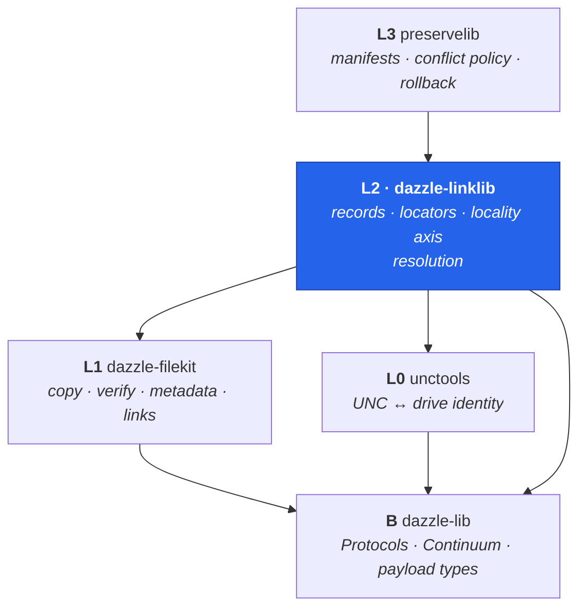

# dazzle-linklib

**Content-addressable link records — the DazzleLib stack's L2 serialization layer.**

```{admonition} Documents v0.5.1
:class: note
Last reviewed 2026-08-02. Anything released since is in the
[changelog](https://github.com/DazzleLib/dazzle-linklib/blob/main/CHANGELOG.md).
```

A link record maps an **identity** to a **typed list of locators** plus metadata, and knows how to serialize, find, and resolve itself. One record can carry a local path family (absolute, relative, UNC/drive/subst) *and* web URLs, and resolution picks a copy on the machine doing the asking — by default local-first with web fallback, or steered by a rung on the **locality ladder** (`local` / `intranet` / `internet`, with open-ended protocol-kind selection).

```console
pip install dazzle-linklib
```

---

## Where this sits

linklib is **L2** in the
[DazzleLib stack](https://github.com/DazzleLib/.github/blob/main/docs/STACK-MAP.md):
it owns *links as portable data* — the record schema, locator list, `content_id`,
relation edges, the locality axis, and the injectable target resolver. File
mechanics live one layer down, path identity below that, orchestration above.



The primary consumer is the [dazzlelink CLI tool](https://github.com/DazzleTools/dazzlelink); preserve's manifest layer and the Relinker anti-link-rot resolver build on the same record.

## Documentation

```{toctree}
:maxdepth: 2

api
api-stability
platform-support
changelog
```
